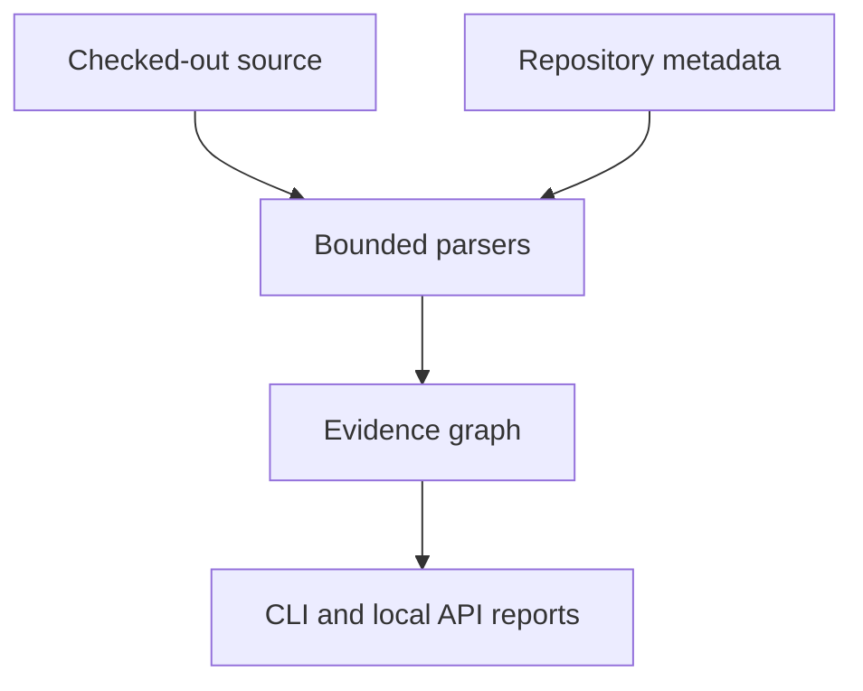

# Repository Lens

Repository Lens (`repolens`) is a read-only static analysis toolkit for one checked-out
repository. The current release focuses on JavaScript/TypeScript (including the Next.js
App Router), Python/FastAPI, and PostgreSQL references. It builds an evidence graph and
exports bounded Mermaid, Markdown, JSON, and SARIF views that a developer can review
before changing code.

The scanner parses source; it does not import or execute the target application, install
target dependencies, run migrations/builds/tests, connect to a database, clone a remote
repository, or infer runtime behavior from a name alone.

## What is implemented

| Area | Verified behavior | Important boundary |
|---|---|---|
| Python | AST functions/classes, import bindings, calls, FastAPI router prefixes/mounts, `db.<collection>`, literal SQL and ORM table declarations | Dynamic registration, factories, type dispatch and runtime authorization remain unresolved |
| JavaScript/TypeScript | Tree-sitter syntax extraction, exports, local/alias imports, calls, `fetch`/Axios-style requests, literal SQL calls, Next.js App Router handlers and dynamic route normalization | No TypeScript compiler/type graph; wrappers, re-exports from other modules, Pages Router, middleware and rewrites are not complete |
| PostgreSQL | SQLGlot parsing of literal PostgreSQL SQL, CTE-aware table references, read/write/DDL detail, SQL variables and ORM class references | No DSN, live catalog, RLS state, migration-head check or query-plan claim |
| Reports | Bounded impact traversal with evidence origin/resolution, Mermaid/Markdown/JSON, SARIF import/export | A “complete” scan means supported checks finished; it is not a safety or correctness proof |
| API | Authenticated loopback FastAPI service with OpenAPI/Swagger UI and a generated Postman collection | One operator-configured local checkout; no multi-tenant server or remote-provider OAuth |
| Extensions | Explicitly enabled trusted Python entry points for other file/database extractors | Plugins are not sandboxed; the local API deliberately does not load them from requests |

Frontend UI, C# analysis, GitHub/GitLab linking, OAuth, hosted workers, and live database
inspection are deliberately deferred. They are tracked in [the roadmap](docs/roadmap.md),
not represented as existing features.

## Install

The base package has no runtime dependency and keeps the existing repository-oriented
commands available. Install the focused stack and API extras for the new workflow:

```bash
python -m pip install -e '.[stack,api]'
```

For the test environment:

```bash
python -m pip install -e '.[stack,api,test]'
```

`stack` provides Tree-sitter grammars and SQLGlot. `api` provides FastAPI and Uvicorn.
Without `stack`, the lower-level `impact` command can fall back to legacy JavaScript
regex extraction and will report that limitation; `analyze` requires the stack extras so
it cannot silently present a degraded result.

## Quick start

Run against the current checkout:

```bash
repolens analyze --out .repolens/analysis
```

The command writes:

```text
.repolens/analysis/
├── analysis.json       # machine-readable graph, diagnostics and findings
├── report.md           # bounded Mermaid diagram plus review tables
├── linkage.mmd         # Mermaid-only view
└── findings.sarif      # normalized SARIF findings
```

Inspect one concept or function without re-reading source after the snapshot:

```bash
repolens analyze --query 'save_item' --max-nodes 40 --out .repolens/analysis
```

The original impact CLI remains available:

```bash
repolens impact scan /path/to/repository
repolens impact query 'checkout' --repo /path/to/repository --format markdown
repolens impact doctor /path/to/repository
```

All scans are bounded by `max_file_bytes` and `max_files`; truncation, unreadable files,
parser recovery and unresolved relationships are explicit diagnostics rather than a
silent “clean” result.

## Local API, Swagger and Postman

The API serves one operator-selected checkout on loopback. Set a random bearer token of
at least 32 characters, then start it from the repository root:

```bash
export REPOLENS_API_TOKEN="$(python -c 'import secrets; print(secrets.token_urlsafe(32))')"
repolens serve --port 8765
```

Open Swagger UI at `http://127.0.0.1:8765/docs`; the raw contract is at
`/openapi.json` and ReDoc is at `/redoc`. The health endpoint is unauthenticated; all
analysis endpoints require `Authorization: Bearer $REPOLENS_API_TOKEN`.

Typical requests:

```bash
curl http://127.0.0.1:8765/health
curl -H "Authorization: Bearer $REPOLENS_API_TOKEN" \
     -X POST http://127.0.0.1:8765/v1/analysis \
     -H 'content-type: application/json' -d '{}'
curl -H "Authorization: Bearer $REPOLENS_API_TOKEN" \
     -X POST http://127.0.0.1:8765/v1/impact \
     -H 'content-type: application/json' \
     -d '{"query":"save_item","max_nodes":30}'
```

Generate contracts from the same FastAPI application used by `serve`:

```bash
repolens api export --out docs/api
```

Import [the Postman collection](docs/api/repository-lens.postman_collection.json) and
[local environment](docs/api/local.postman_environment.json), set `api_token`, and run
the requests in order. The checked-in [OpenAPI document](docs/api/openapi.json) is
regenerated from the application; it is not a hand-maintained second API.

## Configuration

Repository-specific settings are read from `repolens.toml` and then
`.impact-tracer.json`. The impact configuration is additive metadata and safety bounds;
it is not imported as application code. A minimal example:

```toml
[impact]
backend_api_prefix = "/api"
max_file_bytes = 2000000
max_files = 10000
pg_schemas = ["public", "inventory"]
roles = ["admin", "operator"]

[scan.migrations]
roots = ["backend/alembic/versions"]
```

The scanner accepts relative artifact paths only. Absolute paths, `..` traversal and
drive-qualified paths are rejected. The API takes only bounded scan values from a
request and always layers them over the repository’s policy; it never accepts a source
path, command, repository URL or plugin name from the caller.

## Evidence and diagrams

Every graph edge keeps its origin (`tree-sitter`, `python_ast`, `sqlglot`, declared
metadata, heuristic, and so on) separate from its resolution (`exact`, `high`,
`probable`, `declared`, or `ambiguous`). “Exact” describes the syntax or declaration
that was observed; it does not mean the code will execute at runtime. Mermaid output is
bounded and escapes repository-controlled labels so report text cannot inject Mermaid
directives.



## Extending languages and databases

Additional trusted extractors can be installed as Python entry points in the
`repolens.extractors` group. A plugin declares `api_version = 1`, a unique `name`, a
version, lowercase suffixes, and `analyze(SourceFile) -> Extraction`. Enable one
explicitly with:

```bash
repolens analyze --plugin my-extractor
```

Use `repolens analyze --list-plugins` to inspect installed entry-point metadata without
loading plugin code. See [docs/plugins.md](docs/plugins.md) for the contract and safety
rules. A future C# or database adapter should live in a plugin rather than adding an
unverified language guess to the core scanner.

## Testing

```bash
python -m unittest discover -s tests -q
```

The suite covers bounded reads and cache fingerprints, JavaScript/TypeScript syntax and
Next.js routes, FastAPI mounts, PostgreSQL SQL/ORM references, Mermaid sanitization,
SARIF validation, API auth/concurrency/contracts, and report output. `pytest` is not a
runtime requirement for the project’s own tests.

## Documentation

- [docs/impact.md](docs/impact.md) — lower-level graph and query reference
- [docs/api/README.md](docs/api/README.md) — Swagger/OpenAPI/Postman workflow
- [docs/plugins.md](docs/plugins.md) — extractor extension contract
- [docs/roadmap.md](docs/roadmap.md) — implemented scope, open gaps and priorities
- [docs/audit/2026-09-12-professional-foundation.md](docs/audit/2026-09-12-professional-foundation.md) — deep-dive verification and confidence ratings

MIT licensed; see [LICENSE](LICENSE).
