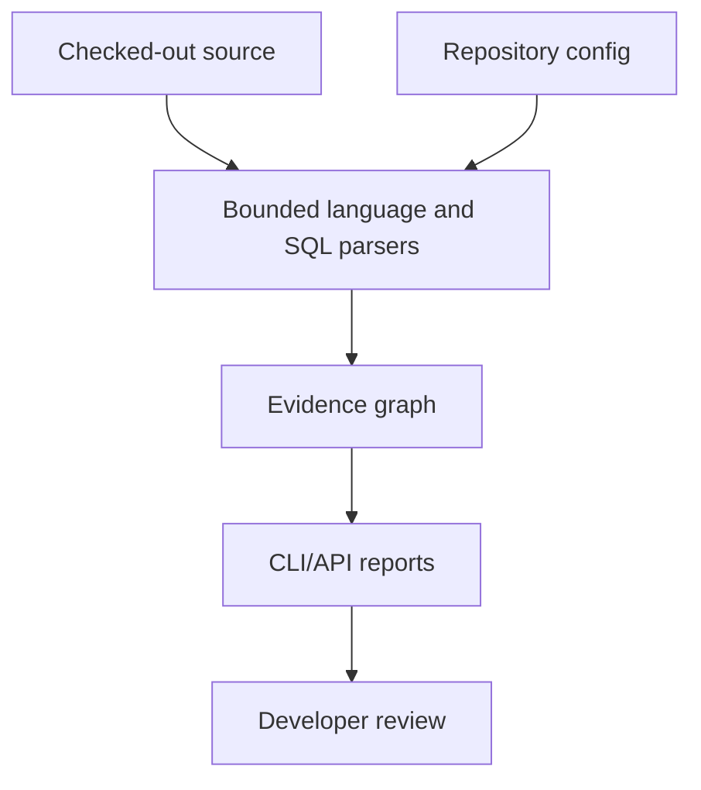

# Deep-dive audit — professional foundation

> Snapshot at the 0.3.0 merge. It is not kept current: the present scope is
> `analysis.LIMITS`, [`docs/roadmap.md`](../roadmap.md) and the CHANGELOG.

Date: 2026-09-12  
Branch: `codex/professional-foundation`  
Baseline: repository `master` at `97097fd`  
Scope: Python/FastAPI, JavaScript/TypeScript/Next.js, PostgreSQL, CLI, local API,
Swagger/OpenAPI, Postman and report safety.

## Method

The audit compared the working tree with the baseline, inspected each new public path,
re-ran the existing tests plus new regression cases, compiled the package, generated the
API contracts, scanned this checkout, and checked that the scan's content fingerprint
matches the independent cache fingerprint. No target repository code was imported or
executed.

Verification performed:

- `python -m unittest discover -s tests -q` in the environment with stack/API extras —
  184 tests passed on Python 3.12. The base environment ran the same suite successfully
  with 21 optional-dependency tests skipped. Starlette/HTTPX deprecation warnings remain.
- `python -m compileall -q repolens tests` — passed.
- `git diff --check` — passed.
- Real checkout scan — completed with explicit diagnostics; no parser or file-read
  failure. The scan reported 99 admitted files, 1,020 nodes, 3,198 edges and 202
  diagnostics at audit time; 194 were advisory ambiguous-call candidates. Two built-in
  findings remain for review; completion is not a zero-findings claim.
- `repository_content_sha(...) == graph.metadata["content_sha256"]` — true.
- OpenAPI generation — five paths (`/health`, `/v1/capabilities`, `/v1/analysis`,
  `/v1/impact`, `/v1/report`) and bearer security on analysis routes.
- Generated Postman collection — requests execute in dependency order against the local
  test client; no token or filesystem path is embedded.

The counts above are observations of this checkout, not product guarantees. They will
change as source and configuration change.

## Corrections made during the audit

| Finding in the previous work | Correction | Confidence |
|---|---|---:|
| PostgreSQL SQL edges changed the established `TOUCHES_STORE` relationship to new names | Restored `TOUCHES_STORE`; read/write/DDL meaning is retained in edge detail, avoiding a graph API break | 9/10 |
| The API and `analyze` path discarded repository `[impact]` and `[scan]` policy | Load repository policy first; request values override only bounded scan knobs within API ceilings | 9/10 |
| A custom migration root could be lost when analysis restricted files to the graph | Migration checks now intersect admitted files with the configured migration roots | 8/10 |
| ORM table references depended on file traversal order | Defer ORM class-reference linking until all admitted Python modules are visited | 8/10 |
| Next route handlers exported through `export { GET }` were missed | Recover local export-clause status for route handler detection | 8/10 |
| Generated relationship artifacts could read outside the repository or leak absolute paths | Artifact paths/configuration are relative-only and artifact reads are bounded | 9/10 |
| Malformed config/SARIF/plugin metadata could raise type errors or make a run look clean | Validate scalar/collection types, SARIF rule IDs and JSON-serializable plugin metadata | 8/10 |
| Previous capability descriptions could be read as broader guarantees than the implementation supports | Rewrote current usage and capability documentation with explicit static-analysis limits; historical comments are not treated as verification evidence | 9/10 |
| Default Alembic files could be excluded by the ordinary Python-check inventory | Preserve a separate admitted inventory for migration checks and assert an actual migration finding | 9/10 |
| Query seeds could exceed a small requested node limit | Bound seed selection by the requested node count | 9/10 |
| Missing SARIF results and malformed declared artifacts could look complete | Mark those inputs incomplete and cover both with regressions | 9/10 |

## What was previously overstated

These are now explicit limits rather than implied capabilities:

- “Generic support for any language/database” was not true. The core is now explicitly
  Python, JavaScript/TypeScript and static PostgreSQL; other languages/databases require
  a trusted extractor plugin.
- A unique name is not an exact call target. Name-only edges are `probable`; imported
  syntax can be `high`, with runtime dispatch still unverified.
- PostgreSQL support does not inspect a PostgreSQL server. It parses literal SQL and
  static ORM/table declarations; it cannot prove catalog existence, RLS enforcement,
  roles, migration heads or query plans.
- JavaScript/TypeScript security and performance checks are not built in. External tools
  can be imported through SARIF; the built-in security/performance checks are primarily
  Python/Alembic.
- Swagger/OpenAPI and Postman are local API contracts, not a hosted UI or provider
  integration. GitHub/GitLab URL linking, OAuth and a browser frontend remain roadmap
  items.
- `complete=true` means the requested supported checks finished without a detected input/parser
  failure. It does not mean vulnerability-free, type-safe, runtime-complete or
  business-correct. The checkout must remain unchanged during analysis; the graph and
  Python findings are separate reads, not an immutable filesystem snapshot.

## Confidence by capability

| Capability | Rating | Why it is not 10 |
|---|---:|---|
| Bounded discovery, symlink/path handling and cache invalidation | 9/10 | Filesystem races and hostile-process isolation still require an external worker sandbox |
| Python AST and import-aware candidates | 8/10 | Dynamic imports, decorators and runtime dispatch remain outside the static model |
| FastAPI prefixes and static router mounts | 7/10 | Factories, `api_route`, conditional registration and `Security` scopes need adapters |
| JavaScript/TypeScript Tree-sitter facts | 8/10 | No compiler type graph; package exports, wrappers and some re-export patterns remain unresolved |
| Next.js App Router handlers | 7/10 | Pages Router, middleware, rewrites and server-action authorization are not modeled |
| PostgreSQL literal SQL/ORM references | 7/10 | SQL dialect coverage and runtime schema/plan state are necessarily incomplete offline |
| Mermaid/Markdown/JSON reports | 7/10 | Node limits and escaping are covered; visual Mermaid rendering has not been verified in a browser |
| SARIF import/export and failure visibility | 8/10 | SARIF producer-specific extensions and external property files are intentionally limited |
| Local API authentication and contracts | 8/10 | Loopback bearer auth is covered; TLS, multi-user identity and job persistence are not in scope |
| Trusted extractor plugin seam | 6/10 | Plugins run in-process and need a stronger compatibility/fixture ecosystem |
| GitHub/GitLab linking and frontend UI | 1/10 | Deliberately not implemented in this increment |

Overall confidence in this release as a useful offline foundation: **7/10**. The rating
reflects tested behavior for the focused stack, not a claim that static analysis closes
all repository risk.

## Architecture under audit

The graph is the durable machine output. Mermaid is a bounded presentation view; SARIF
is a normalized interoperability format; the API keeps the latest analysis in memory
for one local process and discards it on restart.

## Remaining risks to close before hosted use

1. Run the fixture/precision matrix in CI on supported Python and parser versions.
2. Add an immutable checkout worker with resource limits and no network for untrusted
   repositories; the local API is not that sandbox.
3. Add provider credential/OAuth/webhook threat modeling before accepting repository URLs.
4. Add type-aware and framework-specific adapters only with reviewed false-positive
   baselines.
