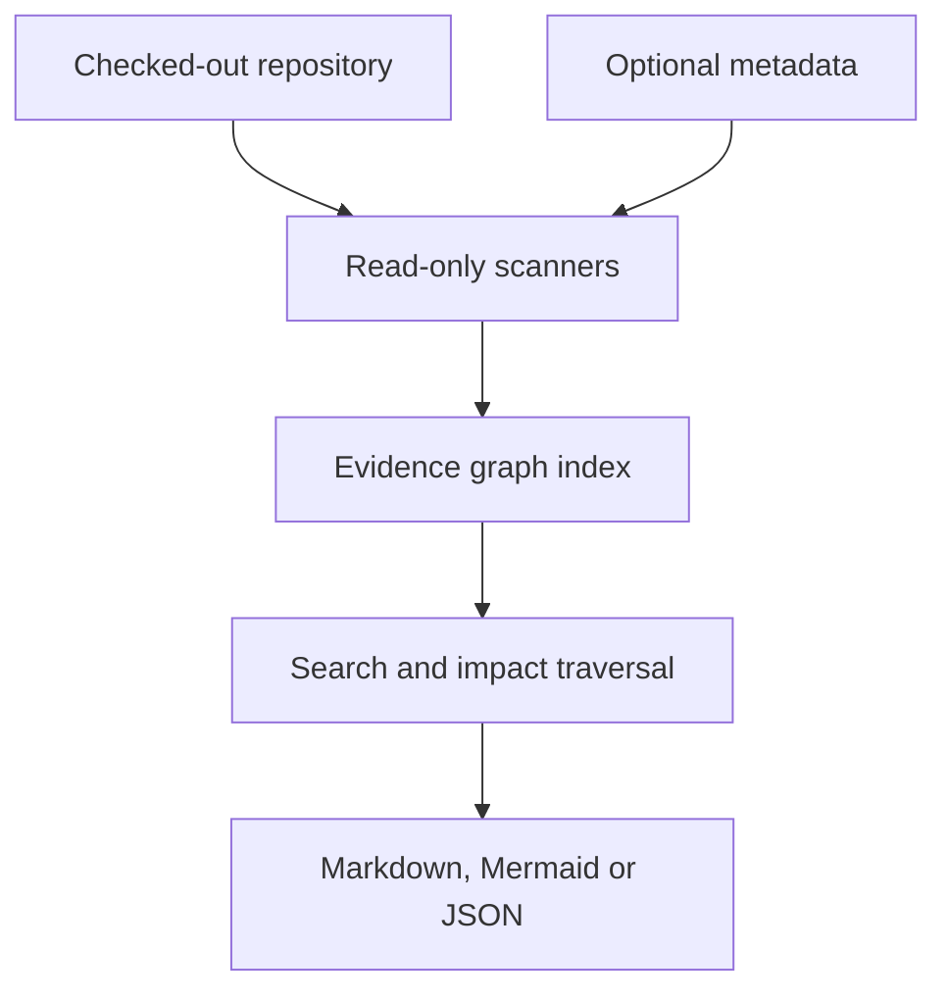

# Impact Tracer

Impact Tracer is a standalone, read-only repository scanner that answers:

> If this concept, page, endpoint, module, or function changes, what else should a developer review?

It scans a checked-out repository without importing or executing the target application's code. It works with zero project configuration for Python, JavaScript and TypeScript repositories. Install `repolens[stack]` for Tree-sitter JavaScript/TypeScript syntax and SQLGlot PostgreSQL parsing; without those extras the lower-level command reports a deliberate degraded-parser diagnostic. Declarative project metadata such as FeatureTrace markers or a generated canonical-owner JSON file is optional.

The tool is deliberately separate from the application it analyses. The application does not import Impact Tracer, and Impact Tracer never connects to its database, server, package manager, build hooks, or runtime.

## Current capabilities

- Python AST extraction for functions, classes, import-bound candidate calls, FastAPI routes (`api_route`, `add_api_route`, websockets), dependencies, request/response models, resolved router prefixes and sub-app mounts, SQLAlchemy/SQLModel/Alembic tables and foreign keys, and MongoDB/ODM collections claimed only through driver methods.
- Tree-sitter JavaScript/TypeScript extraction for declarations, every export form and barrel, local/`tsconfig`-alias imports, calls and JSX renders, `fetch`/SWR/axios/ky requests (module `const` base paths and client base URLs included), Next.js App and Pages Router routes and pages, and SQL assembled in variables. A value spliced into SQL text from a CLI argument, request input or Next.js route `params`/`searchParams` is a `security/sql-string-interpolation` finding (values passed through `Number`/`parseInt` count as safe); other spliced values are named in `DYNAMIC_SQL`. Bare `&` in JSX text is not a parse error.
- A call to a path that is served only for other methods is `API_METHOD_MISMATCH` (a PATCH to a GET-only route, a likely 405), reported as the finding `stack/api-method-mismatch`. A call to a path with no handler at all is `API_CALL_WITHOUT_HANDLER`. Both drop to info when every caller is judged dead: nothing imports, renders or routes to the calling module.
- SQLGlot PostgreSQL table references from literal SQL, with read/write/DDL meaning retained in edge detail; MongoDB collection, role, feature-toggle and FeatureTrace discovery.
- Optional import of `docs/architecture/canonical_owners.json`, including owners, symbols, tests, consumers and recorded violations.
- Free-text, path, concept, page, endpoint and symbol search.
- Bounded incoming/outgoing impact traversal.
- Separate evidence origin and resolution on every edge.
- Markdown, Mermaid and JSON results.
- Diagnostics for ambiguous calls, missing API handlers, handlers with no static caller, dangling FeatureTrace relationships, parser errors and canonical-owner violations.
- Deterministic JSON indexes with automatic content-hash invalidation when source changes.

## What it does not claim

Static analysis can discover structural relationships. It cannot prove that differently named calculations implement the same business concept. Such results require optional curated metadata or remain `similar candidate` findings.

Likewise:

- an import is not proof that a function executes;
- absence of a runtime observation is not proof that a dependency does not exist;
- a name-resolved JavaScript call is less certain than a Python AST relationship;
- a dynamic URL remains a partially resolved template;
- “no discovered linkage” never means “unaffected.”

## Install

Impact Tracer is part of the repolens package (`repolens.impact`). It requires Python 3.11
or later. The base package has no runtime dependencies; the focused parser stack is an
optional extra.

```bash
python -m pip install -e .                  # installs `repolens` and `impact-tracer`
python -m pip install -e '.[stack]'         # recommended for JS/TS and PostgreSQL
repolens impact --help                      # the same CLI as `impact-tracer --help`
```

It can also be run directly without installation:

```bash
PYTHONPATH=. python -m repolens.impact --help
```

## Usage

Build an index:

```bash
impact-tracer scan /path/to/repository
```

Search a concept and produce a Markdown report containing a Mermaid diagram:

```bash
impact-tracer query "order total" \
  --repo /path/to/repository \
  --depth 2 \
  --max-nodes 40 \
  --format markdown \
  --output impact-report.md
```

Query a function or route and return only Mermaid:

```bash
impact-tracer query "calculate_order_total" --repo /path/to/repository --format mermaid
impact-tracer query "/api/orders/{order_id}" --repo /path/to/repository --format mermaid
```

Summarize scan coverage and scanner uncertainty:

```bash
impact-tracer doctor /path/to/repository
```

The included composite `action.yml` can also publish a Markdown/Mermaid report into a GitHub Actions job summary. It is optional and does not add a workflow to the target repository.

The exit codes are:

- `0`: successful scan or query, or doctor ran (doctor is advisory by default);
- `1`: `doctor --fail-on-error` found at least one error-severity issue;
- `2`: the query found no entry point.

`doctor` prints the build (`tool=`) and the configuration fingerprint (`config_sha256=`), so two runs that disagree can be told apart.

## Optional configuration

Put an `[impact]` section in the target repository's `repolens.toml`, place `.impact-tracer.json` in it, or pass `--config`. Sources layer in that order, later over earlier. Configuration is enrichment, not an application dependency.

Application vocabulary is configuration too, and empty by default: `pg_schemas` (schemas whose `<schema>.<table>` names are PostgreSQL tables), `roles` (literal role names), `toggle_calls` (regex fragments for a call whose first argument is a feature toggle) and `mongo_receiver` (default `db`).

Three more keys shape what is read and how HTTP clients resolve:

- `client_api_base`: the base path for an HTTP client the scanner cannot trace to its declaration, such as `const { api } = useAuth()`. When it is unset and the repository declares exactly one client base URL, that one is used.
- `client_receivers`: receiver names (for example `http`) that are such clients.
- `respect_gitignore` (default `true`): untracked files that git ignores (backups, build output) are skipped by the graph and by the built-in Python checks; tracked files are always read. When git cannot list them the scan reports `GITIGNORE_UNAVAILABLE` (info) and reads everything.

```json
{
  "exclude_paths": ["docs/archive", "backend/alembic/versions"],
  "aliases": {
    "order total": ["invoice total", "amount due"]
  },
  "artifacts": {
    "canonical_owners": "docs/architecture/canonical_owners.json"
  },
  "max_ambiguous_targets": 12,
  "max_file_bytes": 2000000,
  "max_files": 10000
}
```

An example profile is included at [`examples/example-project.impact-tracer.json`](../examples/example-project.impact-tracer.json).
Set `backend_api_prefix` only for a prefix the code does not declare (a proxy or `root_path`). A route that
already starts with the prefix keeps its path and the scan reports `API_PREFIX_ALREADY_RESOLVED`, so a proxy
prefix equal to the start of the application's own routes is not added a second time.

## Evidence model

Every edge reports independent dimensions rather than one opaque score:

- `origin`: AST, syntax, framework path, regex, declared project metadata, policy or heuristic;
- `resolution`: exact, high (import-bound syntax), probable, declared or ambiguous;
- `direct`: whether the evidence joins the two nodes directly;
- `activation`: static by default; reserved for conditional, startup, scheduled and user-action classifications;
- `evidence`: source location or artifact that produced the edge.

Impact results use these dimensions to present:

- `query match`;
- `required review`;
- `review recommended`;
- `similar candidate`.

The scanner proposes the review surface. The developer or administrator decides whether each candidate must change.

For the authenticated local API, Swagger/OpenAPI and Postman workflow, see
[`docs/api/README.md`](api/README.md). The API is an operator-configured loopback
service; it does not clone or fetch repositories.

## Security model

The target repository is untrusted input.

- No source file is imported or executed.
- No package is installed from the target.
- No generator, migration, hook, test or build is run.
- Paths referenced by metadata are normalized under the repository root.
- Source files larger than the configured limit are skipped during indexing and phrase search.
- Potential secrets in displayed source snippets are redacted.
- Mermaid labels are escaped and directive-like text is neutralized.

Run Impact Tracer with the same filesystem permissions as a source-code reviewer, not production credentials.

## Architecture



The JSON graph is the durable machine output. Mermaid is a bounded view, not the datastore.

## Tests

```bash
python -m unittest discover -s tests -v
```

The current test corpus covers Python/FastAPI, TypeScript/Next.js, PostgreSQL SQL/ORM
references, canonical concepts and consumers, phrase search, ambiguous calls, dynamic
routes, deterministic indexes, secret/diagram sanitization and all output formats.

## Recommended next increments

1. Add a reviewed fixture corpus and precision/recall measurements for the focused stack.
2. Resolve package `exports` maps and workspace imports with an opt-in type-aware adapter (local re-exports and barrels are already resolved).
3. Add OpenAPI request/response-field lineage and change-kind-aware traversal.
4. Add optional read-only PostgreSQL catalog/RLS and migration-head inspection.
5. Add JavaScript/TypeScript security and performance adapters through SARIF.
6. Add immutable provider checkouts and a browser UI only after the local API/job model is stable.
