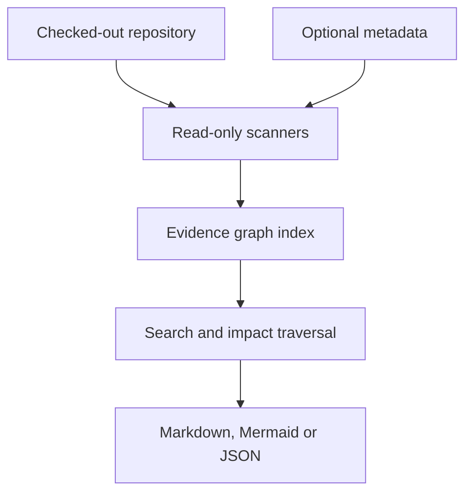

# Impact Tracer

Impact Tracer is a standalone, read-only repository scanner that answers:

> If this concept, page, endpoint, module, or function changes, what else should a developer review?

It scans a checked-out repository without importing or executing the target application's code. It works with zero project configuration for Python, JavaScript and TypeScript repositories, and can optionally read declarative project metadata such as FeatureTrace markers or a generated canonical-owner JSON file.

The tool is deliberately separate from the application it analyses. The application does not import Impact Tracer, and Impact Tracer never connects to its database, server, package manager, build hooks, or runtime.

## Current capabilities

- Python AST extraction for functions, classes, calls, FastAPI decorators and direct `db.<collection>` references.
- JavaScript/TypeScript extraction for functions, local imports, Axios/API/fetch calls and Next.js App Router pages.
- PostgreSQL table, MongoDB collection, role, feature-toggle and FeatureTrace discovery.
- Optional import of `docs/architecture/canonical_owners.json`, including owners, symbols, tests, consumers and recorded violations.
- Free-text, path, concept, page, endpoint and symbol search.
- Bounded incoming/outgoing impact traversal.
- Separate evidence origin and resolution on every edge.
- Markdown, Mermaid and JSON results.
- Diagnostics for ambiguous calls, missing API handlers, handlers with no static caller, dangling FeatureTrace relationships, parser errors and canonical-owner violations.
- Deterministic JSON indexes with automatic content-hash invalidation when source changes.

## What it does not claim

Static analysis can discover structural relationships. It cannot prove that differently named calculations implement the same business concept. Such results require optional curated metadata or remain `similar candidate` findings.

Likewise:

- an import is not proof that a function executes;
- absence of a runtime observation is not proof that a dependency does not exist;
- a name-resolved JavaScript call is less certain than a Python AST relationship;
- a dynamic URL remains a partially resolved template;
- “no discovered linkage” never means “unaffected.”

## Install

Impact Tracer is part of the repolens package (`repolens.impact`). It requires Python 3.11
or later and has no runtime dependencies.

```bash
python -m pip install ./tools/repolens      # installs `repolens` and `impact-tracer`
repolens impact --help                      # the same CLI as `impact-tracer --help`
```

It can also be run directly without installation:

```bash
PYTHONPATH=tools/repolens python -m repolens.impact --help
```

## Usage

Build an index:

```bash
impact-tracer scan /path/to/repository
```

Search a concept and produce a Markdown report containing a Mermaid diagram:

```bash
impact-tracer query "sinking fund balance" \
  --repo /path/to/repository \
  --depth 2 \
  --max-nodes 40 \
  --format markdown \
  --output impact-report.md
```

Query a function or route and return only Mermaid:

```bash
impact-tracer query "horizon_funding_position" --repo /path/to/repository --format mermaid
impact-tracer query "/financials/levy-fairness" --repo /path/to/repository --format mermaid
```

Summarize scan coverage and scanner uncertainty:

```bash
impact-tracer doctor /path/to/repository
```

The included composite `action.yml` can also publish a Markdown/Mermaid report into a GitHub Actions job summary. It is optional and does not add a workflow to the target repository.

The exit codes are:

- `0`: successful scan/query, or doctor found no error-severity issue;
- `1`: doctor found at least one error-severity issue;
- `2`: the query found no entry point.

## Optional configuration

Put an `[impact]` section in the target repository's `repolens.toml`, place `.impact-tracer.json` in it, or pass `--config`. Sources layer in that order, later over earlier. Configuration is enrichment, not an application dependency.

Application vocabulary is configuration too, and empty by default: `pg_schemas` (schemas whose `<schema>.<table>` names are PostgreSQL tables), `roles` (literal role names), `toggle_calls` (regex fragments for a call whose first argument is a feature toggle) and `mongo_receiver` (default `db`). These were hard-coded for StrataOS until 2026-09-10.

```json
{
  "exclude_paths": ["docs/archive", "backend/alembic/versions"],
  "aliases": {
    "fund balance": ["sinking fund balance", "capital works fund balance"]
  },
  "artifacts": {
    "canonical_owners": "docs/architecture/canonical_owners.json"
  },
  "max_ambiguous_targets": 12,
  "max_file_bytes": 2000000
}
```

An example StrataOS profile is included at `examples/strata-management.impact-tracer.json`.

## Evidence model

Every edge reports independent dimensions rather than one opaque score:

- `origin`: AST, syntax, framework path, regex, declared project metadata, policy or heuristic;
- `resolution`: exact, probable, declared or ambiguous;
- `direct`: whether the evidence joins the two nodes directly;
- `activation`: static by default; reserved for conditional, startup, scheduled and user-action classifications;
- `evidence`: source location or artifact that produced the edge.

Impact results use these dimensions to present:

- `query match`;
- `required review`;
- `review recommended`;
- `similar candidate`.

The scanner proposes the review surface. The developer or administrator decides whether each candidate must change.

## Security model

The target repository is untrusted input.

- No source file is imported or executed.
- No package is installed from the target.
- No generator, migration, hook, test or build is run.
- Paths referenced by metadata are normalized under the repository root.
- Files larger than the configured limit are skipped during phrase search.
- Potential secrets in displayed source snippets are redacted.
- Mermaid labels are escaped and directive-like text is neutralized.

Run Impact Tracer with the same filesystem permissions as a source-code reviewer, not production credentials.

## Architecture



The JSON graph is the durable machine output. Mermaid is a bounded view, not the datastore.

## Tests

```bash
cd tools/repolens
python -m unittest discover -s tests -v
```

The current test corpus covers Python/FastAPI, TypeScript/Next.js, canonical concepts and consumers, phrase search, ambiguous calls, dynamic routes, deterministic indexes, secret/diagram sanitization and all output formats.

## Recommended next increments

1. Resolve Python import aliases and TypeScript path aliases so fewer call edges remain ambiguous.
2. Add OpenAPI request/response-field lineage.
3. Import FeatureTrace graph JSON, router/store maps and capability-route inventories through explicit read-only adapters.
4. Add change-kind-aware traversal for calculation, contract, datastore, permission and status changes.
5. Add `git diff main...HEAD` impact reports and SARIF/GitHub Check output.
6. Add exact normalized-function duplicate detection with suppression fingerprints and expiry.
7. Measure precision and recall against a reviewed StrataOS benchmark before introducing semantic or embedding search.

These increments should remain in this standalone package. StrataOS-specific rules belong in an optional profile, not in the core scanner.
