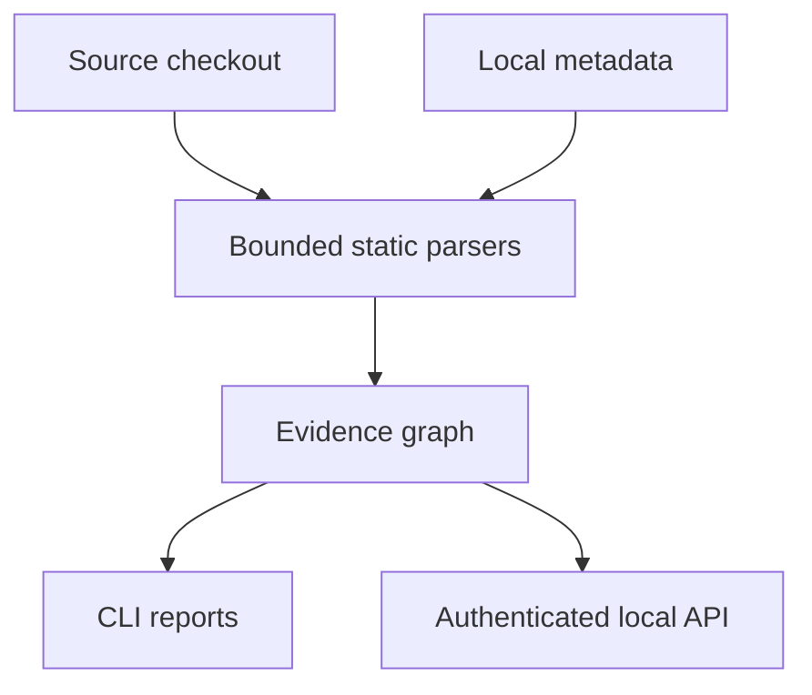

# Roadmap and explicit gaps

This roadmap describes the code that exists in the current `0.3.0` foundation and the
work that remains. It is intentionally conservative: a detector is listed as complete
only when the repository has an implementation and a regression test for its stated
boundary.

## Current foundation

The focused stack currently provides:

- Python AST extraction with import-aware candidate calls, FastAPI router prefixes and
  static `include_router` mounts, ORM table declarations/references, literal SQL and
  Mongo-style collection references.
- Tree-sitter JavaScript/TypeScript extraction for declarations, exports, local and
  `tsconfig`-alias imports, calls, literal `fetch`/Axios requests, literal SQL calls,
  and Next.js App Router route handlers (including dynamic segments and local export
  clauses).
- SQLGlot PostgreSQL parsing for literal SQL, CTE-aware table references and an
  operation detail (`reads`, `writes`, or `declares`). The public graph relationship
  remains `TOUCHES_STORE` for compatibility.
- Bounded source reads, symlink/path checks, deterministic content/config fingerprints,
  per-file failure diagnostics, and explicit incomplete status.
- Mermaid/Markdown/JSON/SARIF reports, SARIF import, a trusted extractor entry-point
  contract, and a loopback FastAPI API with generated OpenAPI and Postman contracts.

## Priority order

### P0 — make the focused stack measurable

1. Add a reviewed fixture corpus for Next.js, FastAPI and PostgreSQL and record precision
   and recall for imports, route matching, SQL tables and ORM references.
2. Add a supported Python/Node version matrix to CI, install the optional extras in CI,
   regenerate API contracts, and run the unittest suite on every pull request.
3. Keep `complete=false` for skipped/failed inputs and expose parser/package versions in
   the graph metadata so reports can be reproduced.

### P1 — improve linkage without pretending to be a compiler

1. Resolve TypeScript re-exports, package `exports` maps and more NodeNext conditions;
   use the TypeScript compiler API only for an opt-in type-aware adapter.
2. Add FastAPI `api_route`, router factories, `Security` scopes and conditional mounts;
   retain unresolved diagnostics for dynamic registration.
3. Add OpenAPI import/export and request/response-field lineage so endpoint changes can
   be reviewed at the contract level.
4. Add change-kind-aware traversal and a `git diff` mode that produces a bounded review
   surface for a pull request.

### P1 — database and analysis depth

1. Add optional, explicitly authorized PostgreSQL inspection for live RLS/table state,
   migration heads and roles. It must be read-only, opt-in and separate from the
   default offline scan.
2. Add JavaScript/TypeScript security and performance adapters (ESLint/Semgrep/SARIF)
   and keep producer failures visible instead of treating missing tools as clean.
3. Extend Python data-flow checks beyond SQL (SSRF, shell/eval, unsafe deserialization,
   path traversal) with reviewed fixtures.

### P2 — integration and breadth

1. Add a separate provider layer for cloning immutable GitHub/GitLab checkouts, with
   short-lived credentials, webhook/OAuth threat modeling, retention rules and no
   target-code execution. This is not present in `0.3.0`.
2. Build a browser UI only after the API contract and job model stabilize. The UI must
   show evidence/resolution and incomplete diagnostics, rather than a binary “safe”
   score.
3. Add C# through a Roslyn/SARIF-backed adapter and add other databases as plugins after
   each has a fixture corpus.

## Non-goals for the current release

- No live database connection, migration execution, package installation, build, test or
  application import.
- No claim of full language support from file-extension detection.
- No claim that a unique name or a parsed SQL table proves runtime execution, ownership,
  authorization, tenant isolation or business equivalence.
- No remote repository URL input or provider token in the local API.
