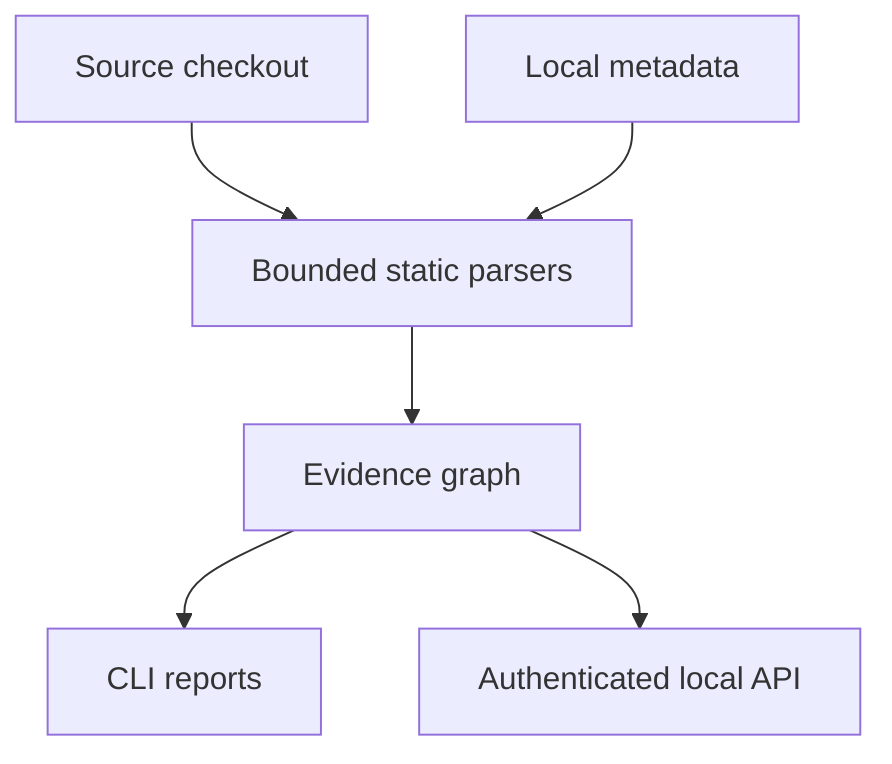

# Roadmap and explicit gaps

This roadmap describes the code that exists in the current `0.3.0` foundation and the
work that remains. It is intentionally conservative: a detector is listed as complete
only when the repository has an implementation and a regression test for its stated
boundary.

The 0.2 roadmap was replaced by this page in 0.3.0. Its sections are cited elsewhere as
"roadmap §1" (the audited defects and their fixes), §2 (still open), §3 (extraction) and
§4 ("A robust product": Python, PostgreSQL, JavaScript/TypeScript and C#). They are kept
verbatim in [history/roadmap-0.2.md](history/roadmap-0.2.md). Changes by release are in
[CHANGELOG.md](../CHANGELOG.md).

## Current foundation

The focused stack currently provides:

- Python AST extraction with import-aware candidate calls (decorators, dependencies and
  monorepo package roots included), FastAPI `api_route`/`add_api_route`/websocket routes,
  `Depends`/`Security` chains, request/response model edges, router prefixes resolved
  from constants and settings defaults, sub-app mounts, SQLAlchemy/SQLModel/Alembic
  tables and foreign keys, and MongoDB driver/ODM collections claimed only through
  driver methods.
- Tree-sitter JavaScript/TypeScript extraction for declarations (object-literal and
  class-field members included), every ES/CommonJS export form, `export * from` barrels,
  `tsconfig`-alias imports through local `extends`, calls, `new`, JSX renders, and
  `fetch`/SWR/axios/ky requests with module-constant base paths and client base URLs
  traced across modules. Bare `&` in JSX text is re-parsed rather than reported.
- SQL assembled in JS/TS variables (template fragments, ternaries, `+=`) is rebuilt with
  spliced values as `$n`, so its tables parse. A spliced value traced within the file to
  `process.argv`, request input or Next.js route `params`/`searchParams` is a
  `security/sql-string-interpolation` finding;
  other spliced values are named in `DYNAMIC_SQL`.
- A call to a path served only for other methods is `API_METHOD_MISMATCH` (the finding
  `stack/api-method-mismatch`); a call with no handler at all is
  `API_CALL_WITHOUT_HANDLER`. Both are demoted to info when every caller cannot run: its module is not imported from any routed page,
  handler or entry file, or it is an exported function no live module imports or calls.
- Next.js App Router route handlers (aliases, wrappers, export clauses) and pages with
  route groups, parallel-route slots and (optional) catch-alls; Pages Router pages and
  API routes. Client calls match handlers by route shape (a literal segment served by a
  dynamic one, an options-hidden method, a catch-all) as `probable` edges.
- SQLGlot PostgreSQL parsing for literal SQL, one statement at a time in `.sql` files,
  with CTE-aware table references, MERGE/TRUNCATE/GRANT/COPY, lexically recovered RLS,
  policy and trigger DDL, and an operation detail (`reads`, `writes`, or `declares`).
  Only SQL-shaped strings are parsed. The public graph relationship remains
  `TOUCHES_STORE` for compatibility.
- `SQL_UNKNOWN_COLUMN`: a column referenced in parsed, non-migration DML that the Prisma
  schema in use (or `CREATE TABLE` DDL for tables without a model) does not declare, with
  the mapped column as a hint, one issue per statement (a file that creates or alters
  the table is not checked against it); `SQL_PLPGSQL_OUTSIDE_BLOCK` for top-level PL/pgSQL in
  `.sql` scripts. Both are advisory and leave the analysis complete.
- JS/TS data-layer declarations and access: Drizzle tables, Prisma schema models and
  client accessors, TypeORM entities, Sequelize and Mongoose models, Knex tables and the
  MongoDB Node driver, each resolved through imports and barrels.
- Deployment-aware exposure for the built-in Python checks. The Python server targets in
  systemd units, Dockerfiles, compose files, Procfiles, supervisord programs and shell
  command lines are resolved to scanned files; package.json scripts and test/CI/dev
  files mark an app live but never make the deployment known. When the
  deployment is statically known, apps nothing deploys rank `undeployed`. Their
  findings are never hidden. Detection fails closed: Kubernetes/Helm/Terraform/App Engine
  manifests, compose YAML the line reader cannot follow, and a server line in a Makefile,
  Taskfile or Windows start script are recognised but not interpreted, so they keep the
  deployment unknown. Interpreting them, and not blocking on unresolved apps in
  auxiliary (dev/test) files, is future work.
- Bounded source reads, symlink/path checks, deterministic content/config fingerprints,
  per-file failure diagnostics, and explicit incomplete status.
- Mermaid/Markdown/HTML/JSON/SARIF reports, SARIF import, a trusted extractor entry-point
  contract, and a loopback FastAPI API with generated OpenAPI and Postman contracts.
- Documentation drafted from the evidence graph for the scanned application: OpenAPI with
  gaps kept, an ER diagram from declared DDL and Prisma, architecture and per-area mindmaps
  with context packs (`docs generate`), and draft FeatureTrace markers, JSDoc and a
  capability-index draft as a reviewable patch (`featuretrace propose`). Request/response
  shapes from zod or TypeScript types, ORM-declared columns and MongoDB fields are future work.

## Priority order

### P0 — make the focused stack measurable

1. Add a reviewed fixture corpus for Next.js, FastAPI and PostgreSQL and record precision
   and recall for imports, route matching, SQL tables and ORM references.
2. Add a supported Python/Node version matrix to CI, install the optional extras in CI,
   regenerate API contracts, and run the unittest suite on every pull request.
3. Keep `complete=false` for skipped/failed inputs. The tool commit, package source hash
   and optional-extra versions are already stamped in `analysis.json` and SARIF
   (`tool_build`); still to do: per-grammar versions (`tree-sitter-javascript`,
   `tree-sitter-typescript`) in the stamp and a documented reproduction procedure.

### P1 — improve linkage without pretending to be a compiler

1. Resolve package `exports` maps, workspace package imports and more NodeNext
   conditions (local re-exports and barrels are resolved); use the TypeScript compiler
   API only for an opt-in type-aware adapter.
2. Add FastAPI router factories, `Security` scope semantics and conditional mounts;
   retain unresolved diagnostics for dynamic registration.
3. Add OpenAPI import/export and request/response-field lineage so endpoint changes can
   be reviewed at the contract level.
4. Add change-kind-aware traversal and a `git diff` mode that produces a bounded review
   surface for a pull request.

### P1 — database and analysis depth

1. Add optional, explicitly authorized PostgreSQL inspection for live RLS/table state,
   migration heads and roles. It must be read-only, opt-in and separate from the
   default offline scan.
2. Add JavaScript/TypeScript security and performance adapters (ESLint/Semgrep/SARIF)
   and keep producer failures visible instead of treating missing tools as clean.
3. Extend Python data-flow checks beyond SQL (SSRF, shell/eval, unsafe deserialization,
   path traversal) with reviewed fixtures.

### P2 — integration and breadth

1. Add a separate provider layer for cloning immutable GitHub/GitLab checkouts, with
   short-lived credentials, webhook/OAuth threat modeling, retention rules and no
   target-code execution. This is not present in `0.3.0`.
2. Build a browser UI only after the API contract and job model stabilize. The UI must
   show evidence/resolution and incomplete diagnostics, rather than a binary “safe”
   score.
3. Add C# through a Roslyn/SARIF-backed adapter and add other databases as plugins after
   each has a fixture corpus.
4. Planned, not implemented: `repolens vendor verify`. It would read a consumer's
   `VENDORED.json` ([format and manual procedure](installation.md#vendoring-a-copy)),
   recompute the vendored directory's git tree hash without the record itself, and
   exit non-zero when it differs from the recorded `tree`. The record is then proof that
   the copy is unmodified upstream `commit`. Given a local upstream checkout, it would
   also confirm `commit^{tree}`. No network access, and no rewriting of the copy.

## Non-goals for the current release

- No live database connection, migration execution, package installation, build, test or
  application import.
- No claim of full language support from file-extension detection.
- No claim that a unique name or a parsed SQL table proves runtime execution, ownership,
  authorization, tenant isolation or business equivalence.
- No remote repository URL input or provider token in the local API.
